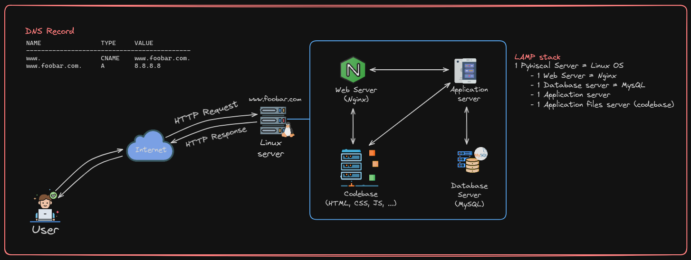
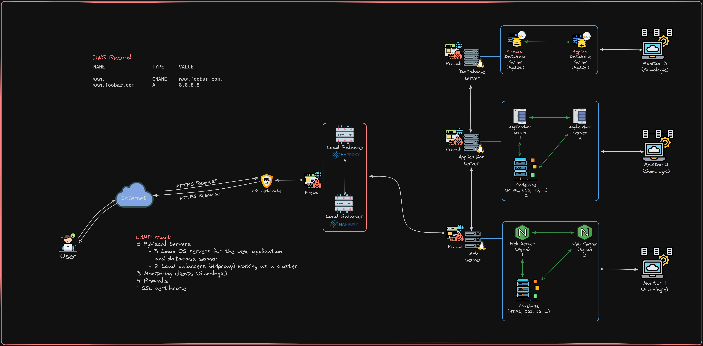

# 0x09. Web infrastructure design

In this project we draw the web infrastructure design of a website that is
reachable via `www.foobar.com`.
The files contain the url to the drawing. The drawings are hosted on [imgur](https://imgur.com/upload).

## Mandatory

### Simple web stack

File: [0-simple_web_stack](./0-simple_web_stack)



This is a simple web infrastructure design that uses a single physical server
with a LAMP stack.

- Requirements:
  - 1 server
  - 1 web server (Nginx)
  - 1 application server
  - 1 application files (your code base)
  - 1 database (MySQL)
  - 1 domain name foobar.com configured with a www record that points to the
    server IP 8.8.8.8
- DNS configuration

```txt
NAME                TYPE     VALUE
--------------------------------------------
www.                CNAME    www.foobar.com.
www.foobar.com.     A        8.8.8.8
```

- Explanation:
  - User request
    - User searches for the `www.foobar.com` or `www` in the browser.
  - DNS Resolution
    - The url `www.foobar.com` or `www` will be resolved to the IP address
      `8.8.8.8`, because the DNS on the server is configured with the DNS
      A record for `www.foobar.com` and the DNS CNAME record for `www` as
      an alias to `www.foobar.com`.
  - Web server (Nginx)
    - The browser sends an HTTP request to the IP address `8.8.8.8`.
    - The web server (Nginx) receives the HTTP request as it is configured to
      listen for incoming connections and processes the request.
  - Static content
    - If the request is for a static webpage like (HTML, CSS, and JavaScript)
      the web server will directly serve these files by fetching them from the
      codebase.
  - Dynamic content
    - If the request is for a dynamic content then the web server will delegate
      the task to the application server.
    - The application server will process the server-side scripting based on
      the configured business logic, and in doing so it might fetch/store data
      from/on the database server (MySQL).
    - After the application server finishes the server-side scripting it builds
      the dynamic HTML content by stitching together the base HTML structure in
      the code base and processed data on the application server.
    - After that the application server sends the dynamically generated HTML
      to the web server.
  - Response to the User
    - So after the web server gets the generated HTML content, whether it be
      static or dynamic, it responds back to the user browser with a
      HTTP response, which contains the HTML webpage.
    - Then the user browser renders or displays the HTML webpage to the user.
- Issues with this design:
  - It has a single point of failure (SPOF). It doesn't provide any redundancy
    at all so if one of the servers crashed or if power goes out the whole system
    is out.
  - The whole system has to go down in order to conduct a maintenance
    operation, or deploy a new code.
  - In the case of too much traffic it will be difficult to scale the system.
  - It does not have any security infrastructure and so is vulnerable to a
    cyber attack.

### Distributed web infrastructure

File: [1-distributed_web_infrastructure](./1-distributed_web_infrastructure)


This design builds upon the simple web stack design by adding two more
servers and in total making it a three server web infrastructure design.

- Additional Requirements:
  - 2 servers
  - 1 web server (Nginx)
  - 1 application server
  - 1 load-balancer (HAproxy)
  - 1 set of application files (your code base)
  - 1 database (MySQL)
- Explanation:
  - In this design two more physical servers are added. One server acts as a
    load balancer and the other one will be an additional linux server used
    for hosting the website.
  - The load balancer will be used to manage traffic load between the two linux
    servers by using an Active-Active setup and a Least connection algorithm.
    This enables us to handle more traffic concurrently, ensure high availability
    and minimize downtime.
    - In an Active-Active setup the two servers are active and are handling HTTP
      requests. This setup is relatively more complex to setup but it ensures
      high availability and it also makes scalability easier. This setup is
      ideal for applications that require high availability and no downtime.
    - An alternative setup is Active-Passive setup, where one server handles all
      traffic and the other is in a passive state waiting to take over when the active
      server is down. This setup is relatively simpler and cost effective but there
      is a possible downtime because when the active server is down the passive
      server might take some time to be active. This setup is ideal for small
      organizations and for applications where a small amount of downtime is tolerated.
    - Least connection algorithm is a load balancing algorithm where the load
      balancer routes traffic to the server with the least connection. This
      provides balance in traffic load between the two servers is more dynamic.
  - The databases are setup in a Primary-Replica cluster.
    - The Primary database is used as the authoritative database that handles
      write and read operations.
    - The Replica database is used as a replica of the primary database and
      handle only read operations. This increases performance by decreasing load
      on the Primary database.
    - So the way the Primary-Replica clustering works is the Primary will be the
      authoritative database and all the other databases will be a replica of the
      Primary. Whenever a write operation is conducted the primary database
      replicates the query to the Replica databases.
    - One advantage of such a setup is that if the Primary database fails the
      Replica database can immediately take over as the new Primary.
  - Issues with this design:
    - While the use of a load balancer and an additional linux server improves
      availability and minimize downtime. There is still a single point of
      failure, that being there is a single load balancer. If the load balancer
      fails the entire system becomes inaccessible even if the linux servers are
      operational.
    - The system doesn't have any security measures setup so it vulnerable to
      cyber attacks.
    - It also doesn't have any monitoring devices, so it is hard to know
      the performance and state of our system.

### Secured and monitored web infrastructure

File: [2-secured_and_monitored_web_infrastructure](./2-secured_and_monitored_web_infrastructure)


This builds upon the distributed web infrastructure design by adding firewalls,
a SSL certificate and monitoring devices.

- Additional Requirements:
  - 3 firewalls
  - 1 SSL certificate to serve `www.foobar.com` over HTTPS
  - 3 monitoring clients (data collector for Sumologic or other monitoring services)
- Explanation:
  - A firewall is a network security device or software that monitors incoming
    and outgoing network traffic and permits or blocks data packets based on a
    set of security rules.
  - A SSL certificate is used to establish a secure and encrypted connection
    over the internet. This allows the use of HTTPS pages instead of HTTP.
  - Monitoring devices allow us to gauge the performance and status of our
    servers. In this design 3 monitoring devices are added, one for each linux
    server and one for the load balancer.
  - Monitoring tools like Sumo Logic can collect metrics, log data and network
    flows by installing agents on the server which continuously collect log
    data and metrics and send the log files back to the monitoring device.
  - Sumo Logic can also be setup to monitor the QPS of the web server. QPS
    stands for Query Per Second and it refers to the number of requests or
    queries the server can handle per second. It is a measure of how much
    traffic the server can handle.
- Issues with this design:
  - In this design it is seen that there is only a single point of encryption at
    the load balancer level, and the issue with that is all the internal networks
    are unencrypted which make the system vulnerable to internal threats.
  - There is only one database, the Primary database, which can accept write requests.
    The issue with this is that in the case where there are heavy write requests
    the system will become slow and unresponsive.
  - Having servers with all the same components (database, web server, and
    application server) can cause issues with maintenance and scalability as
    each component is independent.

### Scale up

File: [3-scale_up](./3-scale_up)


